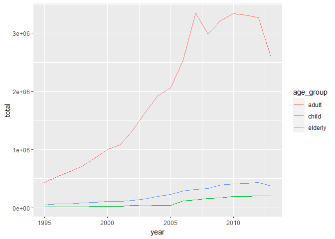
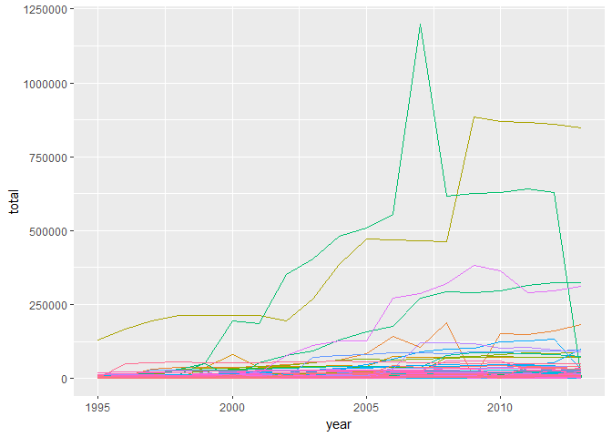

<!-- [Zadanie](http://www.cs.put.poznan.pl/alabijak/emd/04_Powtarzalne_eksperymenty.html#/37) -->

Wczytywanie danych
------------------

Używam `warning=FALSE` oraz `message=FALSE` do ukrycia wiadomości
pojawiających się podczas ładowania biblitek.

    library(dplyr)
    library(tidyr)
    library(ggplot2)
    library(EDAWR)

    df <- tb

Podsumowanie danych
-------------------

Tabela posiada 3800 obserwacjii składa się z 6 kolumn. Są to kolejno
`country`, `year`, `sex`, `child`, `adult`, `elderly`. Tabela jest
tabelą z pakietu `tibble`, a nie podstawową tabelą z R `data.frame`.

Opis kolumn:

-   `country` - kraj z którego pochodzi obserwacja,
-   `year` - rok obserwacji,
-   `sex` - jakiej płci dotyczy obserwacja,
-   `child` - liczba zachorowań w przedziale wiekowym od 0 do 14 lat,
-   `adult` - liczba zachorowań w przedziale wiekowym od 15 do 64 lat,
-   `elderly` - liczba zachorowań w przedziale wiekowym powyżej 64 lat.

Dane nie są w czystym formacie danych, ponieważ posiadamy kolumny
`child`, `adult`, `elderly`. Aby dane sprowadzić do czystego formatu
(zobacz [Tidy Data - Hadley
Wickham](https://vita.had.co.nz/papers/tidy-data.pdf)) należało by dodać
kolumnę `age_group` zawierającą etykiety `child`, `adult`, `elderly`, a
wartości z oryginalnych kolumn zapisać w kolumnie np.: `active_cases`.
Wtedy każda obserwacja posiadałaby osobny wiersz.

#### Podsumowanie

<table style="width:100%;">
<colgroup>
<col style="width: 3%" />
<col style="width: 17%" />
<col style="width: 13%" />
<col style="width: 17%" />
<col style="width: 16%" />
<col style="width: 15%" />
<col style="width: 17%" />
</colgroup>
<thead>
<tr class="header">
<th style="text-align: left;"></th>
<th style="text-align: left;">country</th>
<th style="text-align: left;">year</th>
<th style="text-align: left;">sex</th>
<th style="text-align: left;">child</th>
<th style="text-align: left;">adult</th>
<th style="text-align: left;">elderly</th>
</tr>
</thead>
<tbody>
<tr class="odd">
<td style="text-align: left;"></td>
<td style="text-align: left;">Length:3800</td>
<td style="text-align: left;">Min. :1995</td>
<td style="text-align: left;">Length:3800</td>
<td style="text-align: left;">Min. : 0.0</td>
<td style="text-align: left;">Min. : 0</td>
<td style="text-align: left;">Min. : 0.0</td>
</tr>
<tr class="even">
<td style="text-align: left;"></td>
<td style="text-align: left;">Class :character</td>
<td style="text-align: left;">1st Qu.:1999</td>
<td style="text-align: left;">Class :character</td>
<td style="text-align: left;">1st Qu.: 25.0</td>
<td style="text-align: left;">1st Qu.: 1128</td>
<td style="text-align: left;">1st Qu.: 84.5</td>
</tr>
<tr class="odd">
<td style="text-align: left;"></td>
<td style="text-align: left;">Mode :character</td>
<td style="text-align: left;">Median :2004</td>
<td style="text-align: left;">Mode :character</td>
<td style="text-align: left;">Median : 76.0</td>
<td style="text-align: left;">Median : 2589</td>
<td style="text-align: left;">Median : 230.0</td>
</tr>
<tr class="even">
<td style="text-align: left;"></td>
<td style="text-align: left;"></td>
<td style="text-align: left;">Mean :2004</td>
<td style="text-align: left;"></td>
<td style="text-align: left;">Mean : 493.2</td>
<td style="text-align: left;">Mean : 10864</td>
<td style="text-align: left;">Mean : 1253.0</td>
</tr>
<tr class="odd">
<td style="text-align: left;"></td>
<td style="text-align: left;"></td>
<td style="text-align: left;">3rd Qu.:2009</td>
<td style="text-align: left;"></td>
<td style="text-align: left;">3rd Qu.: 264.5</td>
<td style="text-align: left;">3rd Qu.: 6706</td>
<td style="text-align: left;">3rd Qu.: 640.0</td>
</tr>
<tr class="even">
<td style="text-align: left;"></td>
<td style="text-align: left;"></td>
<td style="text-align: left;">Max. :2013</td>
<td style="text-align: left;"></td>
<td style="text-align: left;">Max. :25661.0</td>
<td style="text-align: left;">Max. :731540</td>
<td style="text-align: left;">Max. :125991.0</td>
</tr>
<tr class="odd">
<td style="text-align: left;"></td>
<td style="text-align: left;"></td>
<td style="text-align: left;"></td>
<td style="text-align: left;"></td>
<td style="text-align: left;">NA’s :396</td>
<td style="text-align: left;">NA’s :413</td>
<td style="text-align: left;">NA’s :413</td>
</tr>
</tbody>
</table>

Ponieważ kolumny `child`, `adult` oraz `elderly` posiadają wartość NA,
należy pamiętać o tym przy operacjach arytmetycznych. W takich wypadkach
należy pominąć wartość NA w obliczeniach, aby wynikiem również nie było
NA.

#### Przykładowe dane

Zobaczmy jeszcze 5 losowych rekordów, żeby zobaczyć z jakimi danymi
będziemy pracować.

<table>
<thead>
<tr class="header">
<th style="text-align: center;">country</th>
<th style="text-align: center;">year</th>
<th style="text-align: center;">sex</th>
<th style="text-align: center;">child</th>
<th style="text-align: center;">adult</th>
<th style="text-align: center;">elderly</th>
</tr>
</thead>
<tbody>
<tr class="odd">
<td style="text-align: center;">Kyrgyzstan</td>
<td style="text-align: center;">1998</td>
<td style="text-align: center;">female</td>
<td style="text-align: center;">3</td>
<td style="text-align: center;">253</td>
<td style="text-align: center;">9</td>
</tr>
<tr class="even">
<td style="text-align: center;">Sudan</td>
<td style="text-align: center;">2009</td>
<td style="text-align: center;">female</td>
<td style="text-align: center;">1420</td>
<td style="text-align: center;">7186</td>
<td style="text-align: center;">233</td>
</tr>
<tr class="odd">
<td style="text-align: center;">Swaziland</td>
<td style="text-align: center;">2012</td>
<td style="text-align: center;">female</td>
<td style="text-align: center;">371</td>
<td style="text-align: center;">2809</td>
<td style="text-align: center;">113</td>
</tr>
<tr class="even">
<td style="text-align: center;">Mongolia</td>
<td style="text-align: center;">2005</td>
<td style="text-align: center;">male</td>
<td style="text-align: center;">7</td>
<td style="text-align: center;">955</td>
<td style="text-align: center;">36</td>
</tr>
<tr class="odd">
<td style="text-align: center;">Uganda</td>
<td style="text-align: center;">2010</td>
<td style="text-align: center;">female</td>
<td style="text-align: center;">401</td>
<td style="text-align: center;">7867</td>
<td style="text-align: center;">248</td>
</tr>
</tbody>
</table>

#### Konwersja do czystego formatu danych

Aby ułatwić przetwarzanie danych w kolejnych zadaniach, dokonam
konwersji danych do czystego formatu z użyciem funkcji `tidyr::gather`.
Funkcję opisano w książce [R Cookbook, Paul
Teetor](http://www.cookbook-r.com/Manipulating_data/Converting_data_between_wide_and_long_format/).

    clean.df <- gather(df, age_group, active_cases, child:elderly)

Zawartość pierwszych 7 rekordów w tabeli `clean.df`:

<table>
<thead>
<tr class="header">
<th style="text-align: center;">country</th>
<th style="text-align: center;">year</th>
<th style="text-align: center;">sex</th>
<th style="text-align: center;">age_group</th>
<th style="text-align: center;">active_cases</th>
</tr>
</thead>
<tbody>
<tr class="odd">
<td style="text-align: center;">Afghanistan</td>
<td style="text-align: center;">1995</td>
<td style="text-align: center;">female</td>
<td style="text-align: center;">child</td>
<td style="text-align: center;"></td>
</tr>
<tr class="even">
<td style="text-align: center;">Afghanistan</td>
<td style="text-align: center;">1995</td>
<td style="text-align: center;">male</td>
<td style="text-align: center;">child</td>
<td style="text-align: center;"></td>
</tr>
<tr class="odd">
<td style="text-align: center;">Afghanistan</td>
<td style="text-align: center;">1996</td>
<td style="text-align: center;">female</td>
<td style="text-align: center;">child</td>
<td style="text-align: center;"></td>
</tr>
<tr class="even">
<td style="text-align: center;">Afghanistan</td>
<td style="text-align: center;">1996</td>
<td style="text-align: center;">male</td>
<td style="text-align: center;">child</td>
<td style="text-align: center;"></td>
</tr>
<tr class="odd">
<td style="text-align: center;">Afghanistan</td>
<td style="text-align: center;">1997</td>
<td style="text-align: center;">female</td>
<td style="text-align: center;">child</td>
<td style="text-align: center;">5</td>
</tr>
<tr class="even">
<td style="text-align: center;">Afghanistan</td>
<td style="text-align: center;">1997</td>
<td style="text-align: center;">male</td>
<td style="text-align: center;">child</td>
<td style="text-align: center;">0</td>
</tr>
<tr class="odd">
<td style="text-align: center;">Afghanistan</td>
<td style="text-align: center;">1998</td>
<td style="text-align: center;">female</td>
<td style="text-align: center;">child</td>
<td style="text-align: center;">45</td>
</tr>
</tbody>
</table>

Zachorowania z podziałem na płeć
--------------------------------

    clean.df %>%
      group_by(sex) %>%
      summarise(total=sum(active_cases, na.rm=TRUE)) %>%
      knitr::kable(align="rl")

<table>
<thead>
<tr class="header">
<th style="text-align: right;">sex</th>
<th style="text-align: left;">total</th>
</tr>
</thead>
<tbody>
<tr class="odd">
<td style="text-align: right;">female</td>
<td style="text-align: left;">15656162</td>
</tr>
<tr class="even">
<td style="text-align: right;">male</td>
<td style="text-align: left;">27062807</td>
</tr>
</tbody>
</table>

Sumaryczne zachorowania w kolejnych latach z podziałem na grupy wiekowe
-----------------------------------------------------------------------

    data <- clean.df %>%
      group_by(year, age_group) %>%
      summarise(total=sum(active_cases, na.rm=TRUE)) %>%
      arrange(year)

    ggplot(data, aes(year, total, col=age_group)) +
      geom_line()

Sumaryczne zachorowania w kolejnych latach z podziałem na kraje
---------------------------------------------------------------

    data <- clean.df %>%
      group_by(year, country) %>%
      summarise(total=sum(active_cases, na.rm=TRUE)) %>%
      arrange(year)

    ggplot(data, aes(year, total, col=country)) +
        geom_line(show.legend = FALSE)

