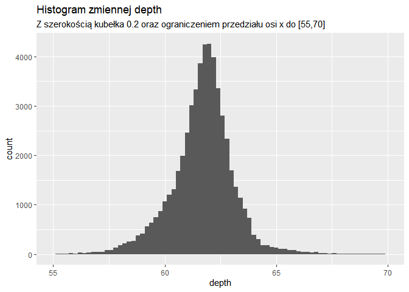
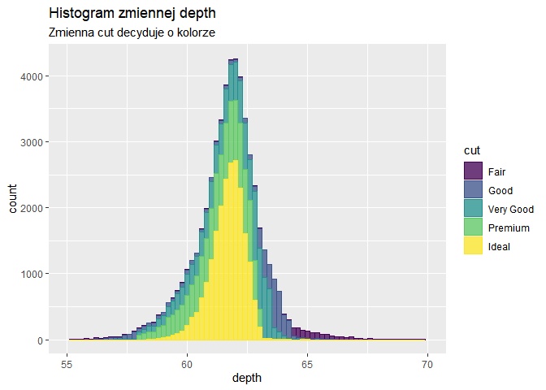
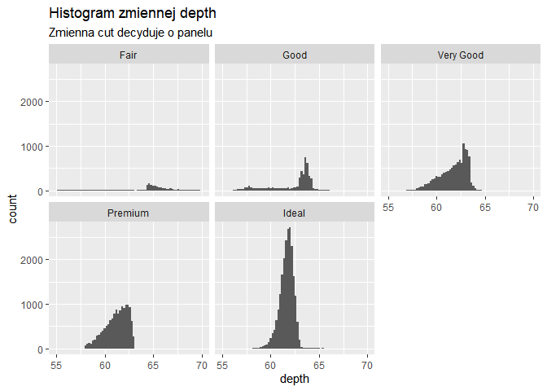
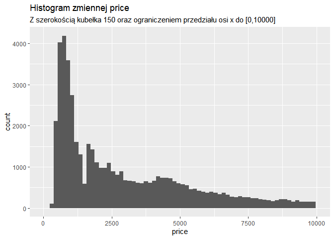
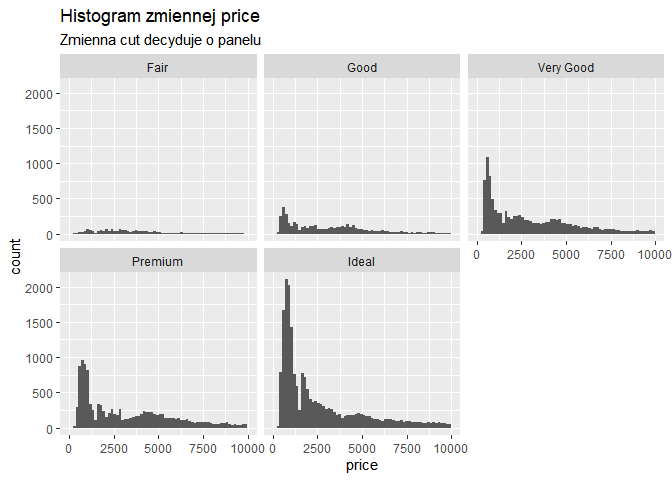

    library(ggplot2)

Punkt 1
-------

    ggplot(diamonds, aes(depth)) + 
      geom_histogram() +
      labs(title="Histogram zmiennej depth")

Punkt 2
-------

    ggplot(diamonds, aes(depth)) + 
      geom_histogram(binwidth = 0.2) +
      labs(
        title="Histogram zmiennej depth",
        subtitle="Z szerokością kubełka 0.2"
        )

Punkt 3
-------

    ggplot(diamonds, aes(depth)) + 
      geom_histogram(binwidth = 0.2) + 
      xlim(c(55, 70)) +
      labs(
        title="Histogram zmiennej depth",
        subtitle="Z szerokością kubełka 0.2 oraz ograniczeniem przedziału osi x do [55,70]"
        )

Punkt 4
-------

    ggplot(diamonds, aes(depth, color=cut, fill=cut)) + 
      geom_histogram(binwidth = 0.2, alpha=0.75) + 
      xlim(c(55, 70)) +
      labs(
        title="Histogram zmiennej depth",
        subtitle="Zmienna cut decyduje o kolorze"
      )

    ggplot(diamonds, aes(depth)) + 
      geom_histogram(binwidth = 0.2) + 
      xlim(c(55, 70)) + 
      facet_wrap(~cut) +
      labs(
        title="Histogram zmiennej depth",
        subtitle="Zmienna cut decyduje o panelu"
      )

Punkt 5
-------

    ggplot(diamonds, aes(price)) + 
      geom_histogram() +
      labs(
        title="Histogram zmiennej price"
      )

    ggplot(diamonds, aes(price)) + 
      geom_histogram(binwidth = 150) +
      labs(
        title="Histogram zmiennej price",
        subtitle="Z szerokością kubełka 150"
      )

    ggplot(diamonds, aes(price)) + 
      geom_histogram(binwidth = 150) + 
      xlim(c(0, 10000)) +
      labs(
        title="Histogram zmiennej price",
        subtitle="Z szerokością kubełka 150 oraz ograniczeniem przedziału osi x do [0,10000]"
      )

    ggplot(diamonds, aes(price, color=cut, fill=cut)) + 
      geom_histogram(binwidth = 150, alpha=0.75) + 
      xlim(c(0, 10000)) +
      labs(
        title="Histogram zmiennej price",
        subtitle="Zmienna cut decyduje o kolorze"
      )

    ggplot(diamonds, aes(price)) + 
      geom_histogram(binwidth = 150) + 
      xlim(c(0, 10000)) +
      facet_wrap(~cut) +
      labs(
        title="Histogram zmiennej price",
        subtitle="Zmienna cut decyduje o panelu"
      )

Punkt 6
-------

    ggplot(diamonds, aes(carat, price, color=price)) +
      geom_point(alpha=0.5, position = position_jitter()) +
      geom_smooth(method = "glm", formula = y ~ poly(x,2), color="orange", size=1.5) +
      ylim(c(0, 20000)) +
      labs(
        title="Relacja między zmiennymi carat i price",
        subtitle="Z modelem GLM o formule y ~ poly(x,2)"
        )

