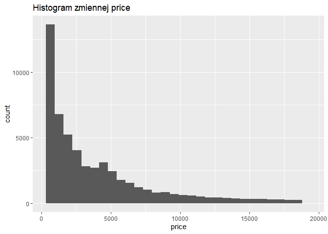
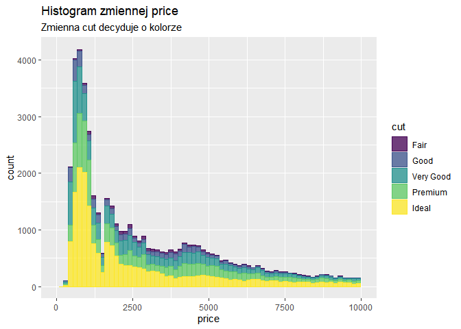
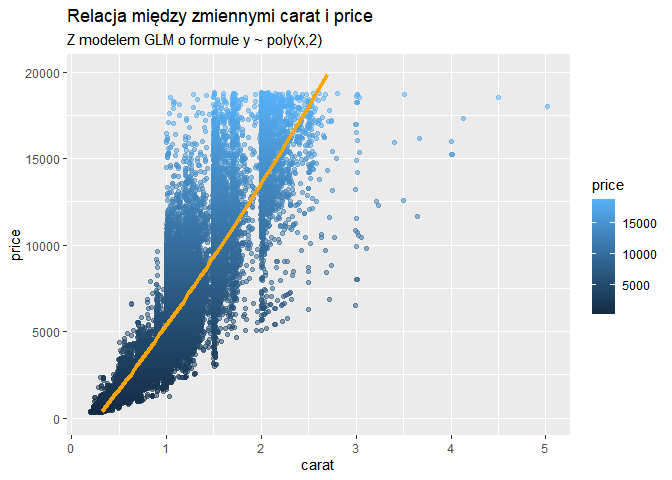

    library(ggplot2)

Punkt 1
-------

Histogram zmiennej `depth`

    ggplot(diamonds, aes(depth)) + geom_histogram()

    ## `stat_bin()` using `bins = 30`. Pick better value with `binwidth`.

Punkt 2
-------

Histogram zmiennej `depth` z szerokością kubełka na 0.2

    ggplot(diamonds, aes(depth)) + geom_histogram(binwidth = 0.2)

Punkt 3
-------

Histogram zmiennej `depth` z szerokością kubełka na 0.2 oraz
ograniczeniem do przedziału osi x do \[50, 70\]

    ggplot(diamonds, aes(depth)) + geom_histogram(binwidth = 0.2) + xlim(c(55, 70))

    ## Warning: Removed 45 rows containing non-finite values (stat_bin).

    ## Warning: Removed 2 rows containing missing values (geom_bar).

Punkt 4
-------

Jak zmienna `cut` wpływa na histogram:

Za pomocą koloru

    ggplot(diamonds, aes(depth, color=cut)) + geom_histogram(binwidth = 0.2) + xlim(c(55, 70))

    ## Warning: Removed 45 rows containing non-finite values (stat_bin).

    ## Warning: Removed 10 rows containing missing values (geom_bar).

Za pomocą paneli

    ggplot(diamonds, aes(depth)) + geom_histogram(binwidth = 0.2) + xlim(c(55, 70)) + facet_wrap(~cut)

    ## Warning: Removed 45 rows containing non-finite values (stat_bin).

    ## Warning: Removed 10 rows containing missing values (geom_bar).

 \#\# Punkt 5 Histogram
zmiennej `price`

    ggplot(diamonds, aes(price)) + geom_histogram()

    ## `stat_bin()` using `bins = 30`. Pick better value with `binwidth`.

Histogram zmiennej `(price)` z szerokością kubełka na 50

    ggplot(diamonds, aes(price)) + geom_histogram(binwidth = 50)

Histogram zmiennej `depth` z szerokością kubełka na 50 oraz
ograniczeniem do przedziału osi x do \[0, 19000\]

    ggplot(diamonds, aes(price)) + geom_histogram(binwidth = 50) + xlim(c(0, 19000))

    ## Warning: Removed 2 rows containing missing values (geom_bar).

Jak zmienna `cut` wpływa na histogram:

Za pomocą koloru

    ggplot(diamonds, aes(price, color=cut)) + geom_histogram(binwidth = 50) + xlim(c(0, 19000))

    ## Warning: Removed 10 rows containing missing values (geom_bar).

Za pomocą paneli

    ggplot(diamonds, aes(price)) + geom_histogram(binwidth = 50) + xlim(c(0, 19000)) + facet_wrap(~cut)

    ## Warning: Removed 10 rows containing missing values (geom_bar).

Punkt 6
-------

Zwizualizuj relację między zmiennymi `carat` i `price`.

    ggplot(diamonds, aes(carat, price)) + geom_point()

