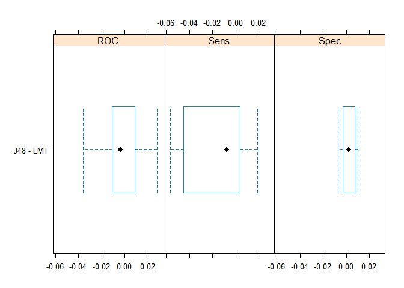
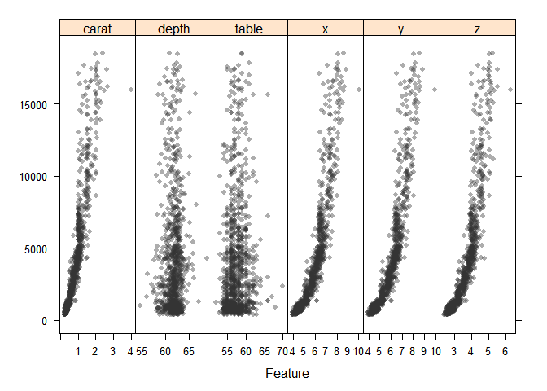

    library(ggplot2)
    library(caret)
    library(modeldata)
    library(tibble)
    library(dplyr)
    library(RWeka)

    my.seed <- 131803

    data(mlc_churn)
    churnData <- as.tibble(data.frame(mlc_churn))

Klasyfikacja
============

Jak wyglądają dane?
-------------------

    knitr::kable(head(churnData))

<table style="width:100%;">
<colgroup>
<col style="width: 1%" />
<col style="width: 4%" />
<col style="width: 4%" />
<col style="width: 5%" />
<col style="width: 4%" />
<col style="width: 6%" />
<col style="width: 5%" />
<col style="width: 4%" />
<col style="width: 4%" />
<col style="width: 5%" />
<col style="width: 4%" />
<col style="width: 4%" />
<col style="width: 5%" />
<col style="width: 5%" />
<col style="width: 5%" />
<col style="width: 5%" />
<col style="width: 4%" />
<col style="width: 5%" />
<col style="width: 8%" />
<col style="width: 1%" />
</colgroup>
<thead>
<tr class="header">
<th style="text-align: left;">state</th>
<th style="text-align: right;">account_length</th>
<th style="text-align: left;">area_code</th>
<th style="text-align: left;">international_plan</th>
<th style="text-align: left;">voice_mail_plan</th>
<th style="text-align: right;">number_vmail_messages</th>
<th style="text-align: right;">total_day_minutes</th>
<th style="text-align: right;">total_day_calls</th>
<th style="text-align: right;">total_day_charge</th>
<th style="text-align: right;">total_eve_minutes</th>
<th style="text-align: right;">total_eve_calls</th>
<th style="text-align: right;">total_eve_charge</th>
<th style="text-align: right;">total_night_minutes</th>
<th style="text-align: right;">total_night_calls</th>
<th style="text-align: right;">total_night_charge</th>
<th style="text-align: right;">total_intl_minutes</th>
<th style="text-align: right;">total_intl_calls</th>
<th style="text-align: right;">total_intl_charge</th>
<th style="text-align: right;">number_customer_service_calls</th>
<th style="text-align: left;">churn</th>
</tr>
</thead>
<tbody>
<tr class="odd">
<td style="text-align: left;">KS</td>
<td style="text-align: right;">128</td>
<td style="text-align: left;">area_code_415</td>
<td style="text-align: left;">no</td>
<td style="text-align: left;">yes</td>
<td style="text-align: right;">25</td>
<td style="text-align: right;">265.1</td>
<td style="text-align: right;">110</td>
<td style="text-align: right;">45.07</td>
<td style="text-align: right;">197.4</td>
<td style="text-align: right;">99</td>
<td style="text-align: right;">16.78</td>
<td style="text-align: right;">244.7</td>
<td style="text-align: right;">91</td>
<td style="text-align: right;">11.01</td>
<td style="text-align: right;">10.0</td>
<td style="text-align: right;">3</td>
<td style="text-align: right;">2.70</td>
<td style="text-align: right;">1</td>
<td style="text-align: left;">no</td>
</tr>
<tr class="even">
<td style="text-align: left;">OH</td>
<td style="text-align: right;">107</td>
<td style="text-align: left;">area_code_415</td>
<td style="text-align: left;">no</td>
<td style="text-align: left;">yes</td>
<td style="text-align: right;">26</td>
<td style="text-align: right;">161.6</td>
<td style="text-align: right;">123</td>
<td style="text-align: right;">27.47</td>
<td style="text-align: right;">195.5</td>
<td style="text-align: right;">103</td>
<td style="text-align: right;">16.62</td>
<td style="text-align: right;">254.4</td>
<td style="text-align: right;">103</td>
<td style="text-align: right;">11.45</td>
<td style="text-align: right;">13.7</td>
<td style="text-align: right;">3</td>
<td style="text-align: right;">3.70</td>
<td style="text-align: right;">1</td>
<td style="text-align: left;">no</td>
</tr>
<tr class="odd">
<td style="text-align: left;">NJ</td>
<td style="text-align: right;">137</td>
<td style="text-align: left;">area_code_415</td>
<td style="text-align: left;">no</td>
<td style="text-align: left;">no</td>
<td style="text-align: right;">0</td>
<td style="text-align: right;">243.4</td>
<td style="text-align: right;">114</td>
<td style="text-align: right;">41.38</td>
<td style="text-align: right;">121.2</td>
<td style="text-align: right;">110</td>
<td style="text-align: right;">10.30</td>
<td style="text-align: right;">162.6</td>
<td style="text-align: right;">104</td>
<td style="text-align: right;">7.32</td>
<td style="text-align: right;">12.2</td>
<td style="text-align: right;">5</td>
<td style="text-align: right;">3.29</td>
<td style="text-align: right;">0</td>
<td style="text-align: left;">no</td>
</tr>
<tr class="even">
<td style="text-align: left;">OH</td>
<td style="text-align: right;">84</td>
<td style="text-align: left;">area_code_408</td>
<td style="text-align: left;">yes</td>
<td style="text-align: left;">no</td>
<td style="text-align: right;">0</td>
<td style="text-align: right;">299.4</td>
<td style="text-align: right;">71</td>
<td style="text-align: right;">50.90</td>
<td style="text-align: right;">61.9</td>
<td style="text-align: right;">88</td>
<td style="text-align: right;">5.26</td>
<td style="text-align: right;">196.9</td>
<td style="text-align: right;">89</td>
<td style="text-align: right;">8.86</td>
<td style="text-align: right;">6.6</td>
<td style="text-align: right;">7</td>
<td style="text-align: right;">1.78</td>
<td style="text-align: right;">2</td>
<td style="text-align: left;">no</td>
</tr>
<tr class="odd">
<td style="text-align: left;">OK</td>
<td style="text-align: right;">75</td>
<td style="text-align: left;">area_code_415</td>
<td style="text-align: left;">yes</td>
<td style="text-align: left;">no</td>
<td style="text-align: right;">0</td>
<td style="text-align: right;">166.7</td>
<td style="text-align: right;">113</td>
<td style="text-align: right;">28.34</td>
<td style="text-align: right;">148.3</td>
<td style="text-align: right;">122</td>
<td style="text-align: right;">12.61</td>
<td style="text-align: right;">186.9</td>
<td style="text-align: right;">121</td>
<td style="text-align: right;">8.41</td>
<td style="text-align: right;">10.1</td>
<td style="text-align: right;">3</td>
<td style="text-align: right;">2.73</td>
<td style="text-align: right;">3</td>
<td style="text-align: left;">no</td>
</tr>
<tr class="even">
<td style="text-align: left;">AL</td>
<td style="text-align: right;">118</td>
<td style="text-align: left;">area_code_510</td>
<td style="text-align: left;">yes</td>
<td style="text-align: left;">no</td>
<td style="text-align: right;">0</td>
<td style="text-align: right;">223.4</td>
<td style="text-align: right;">98</td>
<td style="text-align: right;">37.98</td>
<td style="text-align: right;">220.6</td>
<td style="text-align: right;">101</td>
<td style="text-align: right;">18.75</td>
<td style="text-align: right;">203.9</td>
<td style="text-align: right;">118</td>
<td style="text-align: right;">9.18</td>
<td style="text-align: right;">6.3</td>
<td style="text-align: right;">6</td>
<td style="text-align: right;">1.70</td>
<td style="text-align: right;">0</td>
<td style="text-align: left;">no</td>
</tr>
</tbody>
</table>

Podział zbioru danych
---------------------

    set.seed(my.seed)
    inTraining <- createDataPartition(y = churnData$churn, p = .75,list = FALSE)

    training <- churnData[ inTraining,]
    testing  <- churnData[-inTraining,]

Trenowanie klasyfikatorów
-------------------------

    ctrl <- trainControl(method = "repeatedcv", number = 2, repeats = 5)

    set.seed(my.seed)
    model.j48 <- train(churn ~ ., data = training, method = "J48", trControl = ctrl)
    model.lmt <- train(churn ~ ., data = training, method = "LMT", trControl = ctrl)

Wyniki na zbiorze testowym
--------------------------

#### Wyniki dla algorytmu `Logistic Model Trees`

    confusionMatrix(data = predict(model.lmt, newdata = testing), testing$churn)

    ## Confusion Matrix and Statistics
    ## 
    ##           Reference
    ## Prediction  yes   no
    ##        yes  127    9
    ##        no    49 1064
    ##                                           
    ##                Accuracy : 0.9536          
    ##                  95% CI : (0.9404, 0.9646)
    ##     No Information Rate : 0.8591          
    ##     P-Value [Acc > NIR] : < 2.2e-16       
    ##                                           
    ##                   Kappa : 0.7881          
    ##                                           
    ##  Mcnemar's Test P-Value : 3.04e-07        
    ##                                           
    ##             Sensitivity : 0.7216          
    ##             Specificity : 0.9916          
    ##          Pos Pred Value : 0.9338          
    ##          Neg Pred Value : 0.9560          
    ##              Prevalence : 0.1409          
    ##          Detection Rate : 0.1017          
    ##    Detection Prevalence : 0.1089          
    ##       Balanced Accuracy : 0.8566          
    ##                                           
    ##        'Positive' Class : yes             
    ## 

#### Wyniki dla algorytmu `J48`

    confusionMatrix(data = predict(model.j48, newdata = testing), testing$churn)

    ## Confusion Matrix and Statistics
    ## 
    ##           Reference
    ## Prediction  yes   no
    ##        yes  123    9
    ##        no    53 1064
    ##                                           
    ##                Accuracy : 0.9504          
    ##                  95% CI : (0.9368, 0.9617)
    ##     No Information Rate : 0.8591          
    ##     P-Value [Acc > NIR] : < 2.2e-16       
    ##                                           
    ##                   Kappa : 0.771           
    ##                                           
    ##  Mcnemar's Test P-Value : 4.734e-08       
    ##                                           
    ##             Sensitivity : 0.69886         
    ##             Specificity : 0.99161         
    ##          Pos Pred Value : 0.93182         
    ##          Neg Pred Value : 0.95255         
    ##              Prevalence : 0.14091         
    ##          Detection Rate : 0.09848         
    ##    Detection Prevalence : 0.10568         
    ##       Balanced Accuracy : 0.84524         
    ##                                           
    ##        'Positive' Class : yes             
    ## 

Czy warto wstępnie przetworzyć zbiór?
-------------------------------------

Moim zdaniem zawsze warto przetworzyć zbiór danych, wiele algorytmów na
tym może skorzystać np.: sieci neuronowe czy SVM wręcz wymagają
ustandaryzowanych danych. Wiele algorytmów nie przyjmuje też na wejście
tekstu/kategori i trzeba je specjalnie kodować.

Sprawdźmy jeszcze jak zachowa się algorytm `J48` kiedy wstępnie
przetworzymy dane:

    model.pre.j48 <- train(churn ~ ., data = training, method = "J48", trControl = ctrl, preProc = c("center", "scale"))
    confusionMatrix(data = predict(model.pre.j48, newdata = testing), testing$churn)

    ## Confusion Matrix and Statistics
    ## 
    ##           Reference
    ## Prediction  yes   no
    ##        yes  126    8
    ##        no    50 1065
    ##                                           
    ##                Accuracy : 0.9536          
    ##                  95% CI : (0.9404, 0.9646)
    ##     No Information Rate : 0.8591          
    ##     P-Value [Acc > NIR] : < 2.2e-16       
    ##                                           
    ##                   Kappa : 0.7869          
    ##                                           
    ##  Mcnemar's Test P-Value : 7.303e-08       
    ##                                           
    ##             Sensitivity : 0.7159          
    ##             Specificity : 0.9925          
    ##          Pos Pred Value : 0.9403          
    ##          Neg Pred Value : 0.9552          
    ##              Prevalence : 0.1409          
    ##          Detection Rate : 0.1009          
    ##    Detection Prevalence : 0.1073          
    ##       Balanced Accuracy : 0.8542          
    ##                                           
    ##        'Positive' Class : yes             
    ## 

Jak widać wyniki poprawiły się, dla przykłdu `Sensitivity` wzrosło z
0.69886 do 0.7159, a `Specificity` nieznacznie z 0.99161 do 0.9925.

Określ przestrzeń przeszukiwania parametrów
-------------------------------------------

Ustawiłem przestrzeń poszukiwania hiperparametrów dla `J48` taką, że
parametr `C` (pruning confidence) na wektor c(0.1, 0.25, 0.3), a
parametr `M` (minimum number of instances in leaf) na wektor c(1, 2, 5,
10). Oba wektory zawierają wartości domyślne.

Dla alorytmu `LMT` ustawiłem jedyny parametr `iter` na wartości c(10,
20, 30).

    j48.grid <- expand.grid(C=c(0.1, 0.25, 0.3) , M=c(1, 2, 5, 10))
    lmt.grid <- expand.grid(iter=c(10, 20, 30))
    ctrl <- trainControl(method = "repeatedcv", number = 2, repeats = 5, classProbs = TRUE, summaryFunction = twoClassSummary)

    set.seed(my.seed)
    j48.tune.fit <- train(churn ~ ., data = training, 
                          method = "J48", metric = "ROC", 
                          preProc = c("center", "scale"),
                          trControl=ctrl,
                          tuneGrid = j48.grid)

    set.seed(my.seed)
    lmt.tune.fit <- train(churn ~ ., data = training, 
                          method = "LMT", metric = "ROC", 
                          preProc = c("center", "scale"),
                          trControl=ctrl,
                          tuneGrid = lmt.grid)

Prównanie algorytmów za pomocą wykresu
--------------------------------------

    resamps <- resamples(list(J48 = j48.tune.fit, LMT = lmt.tune.fit))
    difValues <- diff(resamps)
    difValues

    ## 
    ## Call:
    ## diff.resamples(x = resamps)
    ## 
    ## Models: J48, LMT 
    ## Metrics: ROC, Sens, Spec 
    ## Number of differences: 1 
    ## p-value adjustment: bonferroni

    theme1 <- trellis.par.get()
    theme1$plot.symbol$col = rgb(.2, .2, .2, .4)
    theme1$plot.symbol$pch = 16
    theme1$plot.line$col = rgb(1, 0, 0, .7)
    theme1$plot.line$lwd <- 2

    trellis.par.set(theme1)
    bwplot(difValues, layout = c(3, 1))

 Porównanie
wartości pokazuje niewielką przewagę `LMT` nad `J48`, jednakże jest to
tak marginalna różnica, że można powiedzieć, że algorytmy mają
identyczną jakość.

Regresja
========

Podział danych
--------------

    data(diamonds)
    inTraining <- createDataPartition(y=diamonds$price, p=.7, list=FALSE)

    training <- diamonds[inTraining,]
    testing <- diamonds[-inTraining,]

Trenowanie modelu
-----------------

    ctrl <- trainControl(method = "repeatedcv", number = 2, repeats = 5)
    set.seed(my.seed)

    model.lm <- train(price ~ ., data = training, method = "lm", trControl = ctrl, preProc = c("center", "scale"))

Predykcja na zbiorze testowym
-----------------------------

    y_hat = predict(model.lm, newdata=select(testing, -c(price)))
    y = testing$price

    RMSE(y_hat, y)

    ## [1] 1130.29

Wpływ zmiennych na cenę diamentu
--------------------------------

    cols <- c("carat","depth","table","x","y","z")

    small_df <- sample_n(diamonds, 1000)
    featurePlot(x = small_df[,cols],
                y = small_df$price, 
                plot = "scatter",
                layout = c(length(cols), 1))

