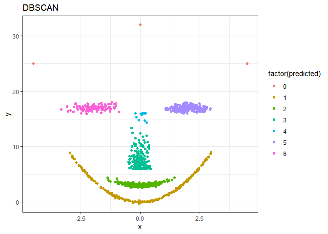

    library(ggplot2)
    library(factoextra)
    library(fpc)
    library(NbClust)
    library(aricode) # For AMI
    library(dplyr)
    library(tibble)
    library(pheatmap)

    set.seed(23)
    face <- rFace(1000, p=2, dMoNo=3)
    df = data.frame(x=face[,1], y=face[,2])
    labels = as.integer(attr(face,"grouping"))

Faktyczne dane
--------------

    plot_face <-function(predicted, name){
      p <- ggplot(df, aes(x, y, color=factor(predicted))) + geom_point() + theme_bw() + labs(title=name)
      return(p)
    }

    plot_face(labels, "Dane oryginalne")

K-średnie
---------

    km.res <- eclust(df, "kmeans", k = length(unique(labels)), nstart = 25, graph = F)
    fviz_cluster(km.res, palette = "jco", ggtheme = theme_minimal())

K-medioidy
----------

    pam.res <- eclust(df, "pam", k = length(unique(labels)), graph = F)
    fviz_cluster(pam.res, palette = "jco", ggtheme = theme_minimal())

AHC
---

    ahc.res <- eclust(df, "hclust", k = length(unique(labels)), hc_metric = "euclidean", hc_method = "ward.D2", graph = F)
    fviz_dend(ahc.res, show_labels = F, palette = "jco", as.ggplot = T)

    fviz_cluster(ahc.res, palette = "jco", ggtheme = theme_minimal())

DBSCAN
------

    db.res <- fpc::dbscan(df, eps=0.25, MinPts=4, scale=TRUE)
    fviz_cluster(db.res, df, stand=F, ellipse=F, show.clust.cent=F, geom="point", palette="jco", ggtheme= theme_classic())

Porównanie jakości grupowania
-----------------------------

### Miara liczbowa

Tabela zawiera algorytmy posortowane malejąco według wyniku AMI.

    data.frame(algorytm=c("K-średnie", "K-medioidy", "AHC", "DBSCAN"),
               AMI=c(
                 AMI(km.res$cluster, labels),
                 AMI(pam.res$cluster, labels),
                 AMI(ahc.res$cluster, labels),
                 AMI(db.res$cluster, labels)
               )
    ) %>% as.tibble() %>% arrange(desc(AMI)) %>% knitr::kable()

<table>
<thead>
<tr class="header">
<th style="text-align: left;">algorytm</th>
<th style="text-align: right;">AMI</th>
</tr>
</thead>
<tbody>
<tr class="odd">
<td style="text-align: left;">DBSCAN</td>
<td style="text-align: right;">0.9737360</td>
</tr>
<tr class="even">
<td style="text-align: left;">K-średnie</td>
<td style="text-align: right;">0.7933811</td>
</tr>
<tr class="odd">
<td style="text-align: left;">AHC</td>
<td style="text-align: right;">0.7865455</td>
</tr>
<tr class="even">
<td style="text-align: left;">K-medioidy</td>
<td style="text-align: right;">0.7440690</td>
</tr>
</tbody>
</table>

### Macierz pomyłek

    hmap = function(predicted, name){
      pheatmap(table(labels, predicted), color = colorRampPalette(c('grey','white'))(10), display_numbers = TRUE,
               cluster_rows = F, cluster_cols = F, main=paste("Macierz pomyłek dla", name), fontsize = 11, legend=TRUE)
    }

    hmap(km.res$cluster, "K-średnich")

    hmap(pam.res$cluster, "K-medioidów")

    hmap(ahc.res$cluster, "AHC")

    hmap(db.res$cluster, "DBSCAN")

### Wizulaizajca danych

    plot_face(km.res$cluster, "Algorytm K-średnich")

    plot_face(pam.res$cluster, "Algorytm K-medioidów")

    plot_face(ahc.res$cluster, "AHC")

    plot_face(db.res$cluster, "DBSCAN")

